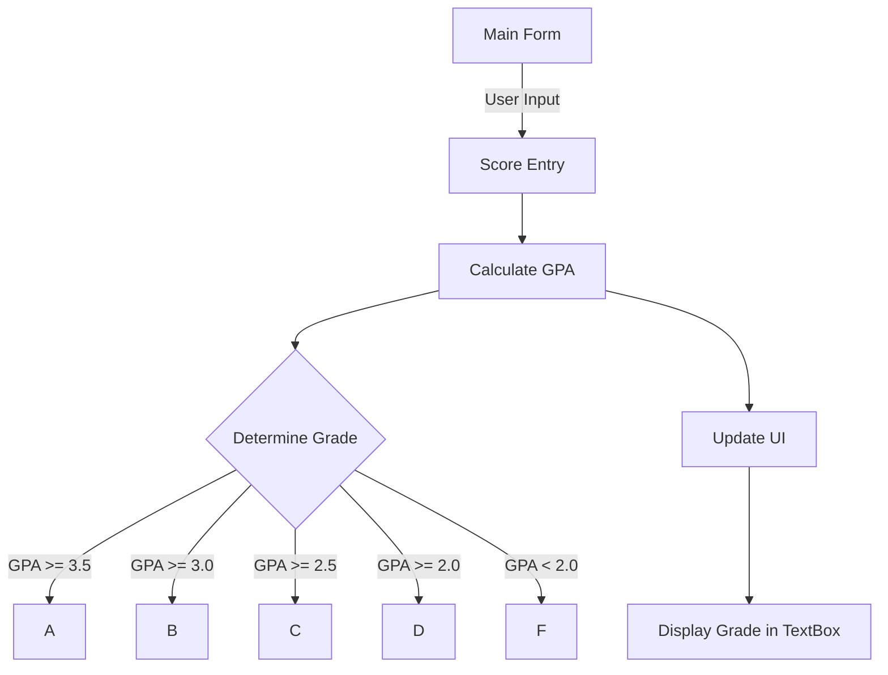

# GPA Calculator - Windows Forms Application

## 📌 Overview
This project is a **Windows Forms Application** built with **C#** for calculating and displaying GPA based on user-entered scores. The application allows users to input scores, compute grades, and display both numerical and letter grades.

---

## 🎯 Features
✅ Enter multiple scores
✅ Calculate the average score (GPA)
✅ Convert numerical GPA to a letter grade (A, B, C, etc.)
✅ Display grades dynamically in a TextBox or Label
✅ Simple and user-friendly UI

---

## 🛠️ Project Structure


---

## 🏗️ Installation & Setup
1. **Clone the Repository**
   ```sh
   git clone https://github.com/your-repo/gpa-calculator.git
   ```
2. **Open the Project**
   - Open `GPA_Calculator.sln` in **Visual Studio**
3. **Run the Application**
   - Press `F5` to build and run

---

## 🔢 How GPA is Calculated
The GPA is calculated using the following formula:
```csharp
public double GetGrade()
{
    return scores.Count > 0 ? scores.Average() : 0;
}
```

---

## 🔤 Letter Grade Conversion
```csharp
public string GetLetterGrade()
{
    double grade = GetGrade();
    if (grade >= 3.5) return "A";
    if (grade >= 3.0) return "B";
    if (grade >= 2.5) return "C";
    if (grade >= 2.0) return "D";
    return "F";
}
```

---

## 📷 UI Preview


---

## 💡 Future Improvements
- Add a database to store student records
- Export GPA results to a PDF report
- Add graphical grade distribution visualization

---

## 📝 License
This project is licensed under the **MIT License**.
