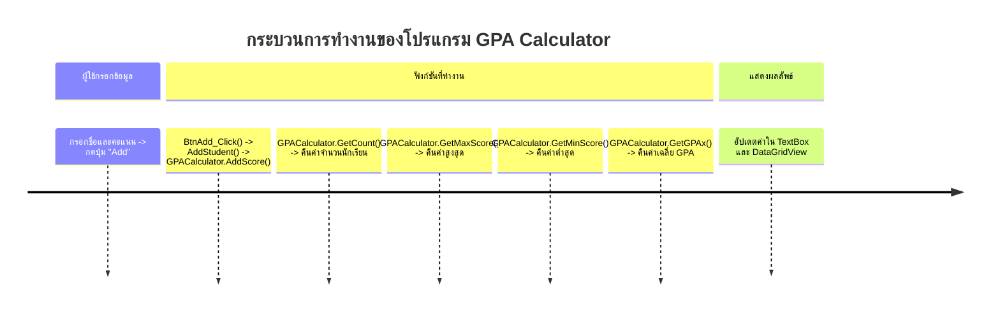
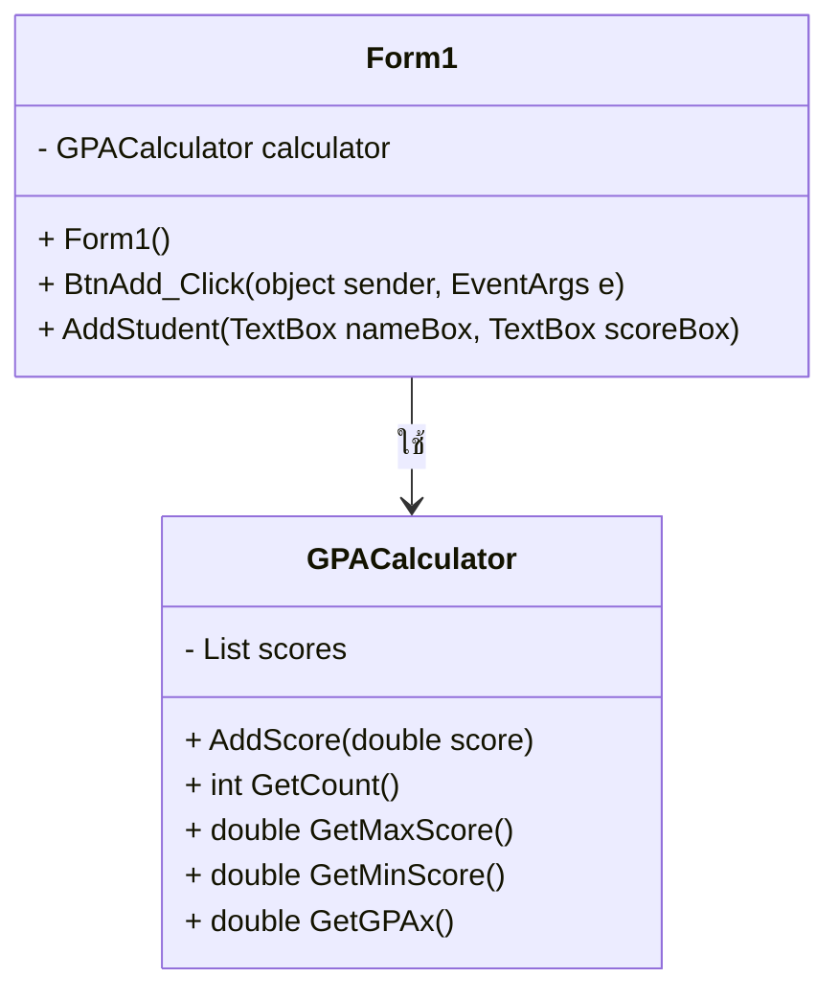

# GPA Calculator

นาย ณัฐพัชร ศิริวราพัฒน์  รหัสนักศึุกษา 673450035-6

## รายละเอียดโปรเจกต์
โปรเจกต์นี้เป็น Windows Forms Application ที่ใช้สำหรับคำนวณค่าต่างๆ ของคะแนนนักเรียน เช่น จำนวนคะแนนสูงสุด, ต่ำสุด, ค่าเฉลี่ย GPA ฯลฯ โดยใช้คลาส `GPACalculator`

---

## โครงสร้างโปรแกรม


---

## โครงสร้างคลาส `GPACalculator`


---

## วิธีการใช้งาน
1. รันโปรแกรม `GPA Calculator` บน Windows Forms
2. กรอกชื่อนักเรียนและคะแนนลงในช่องที่กำหนด
3. กดปุ่ม **"Add"** เพื่อเพิ่มข้อมูล
4. โปรแกรมจะแสดงจำนวนข้อมูล, คะแนนสูงสุด, คะแนนต่ำสุด และค่าเฉลี่ย GPA บน UI

---

## ฟังก์ชันหลัก
| ฟังก์ชัน | คำอธิบาย |
|----------|-----------|
| `AddScore(double score)` | เพิ่มคะแนนเข้าไปใน `List<double> scores` |
| `GetCount()` | คืนค่าจำนวนคะแนนที่ถูกเพิ่มเข้ามา |
| `GetMaxScore()` | คืนค่าคะแนนที่สูงที่สุด |
| `GetMinScore()` | คืนค่าคะแนนที่ต่ำที่สุด |
| `GetGPAx()` | คืนค่าคะแนนเฉลี่ย GPA |

---

## ตัวอย่างโค้ดหลัก
```csharp
// ฟังก์ชันเพิ่มคะแนน
public void AddScore(double score) {
    scores.Add(score);
}

// ฟังก์ชันคืนค่าจำนวนคะแนนทั้งหมด
public int GetCount() {
    return scores.Count;
}

// ฟังก์ชันคืนค่าคะแนนสูงสุด
public double GetMaxScore() {
    return scores.Count > 0 ? scores.Max() : 0;
}
```

---

## หมายเหตุ
- โค้ดนี้รองรับ Windows Forms และต้องเพิ่ม `DataGridView` และ `TextBox` ให้ตรงกับที่ใช้ในโค้ด
- ควรตรวจสอบการแปลงค่าข้อมูลจาก TextBox ก่อนนำไปใช้เพื่อป้องกันข้อผิดพลาด

---

## ผู้พัฒนา
- **ชื่อ:** (ใส่ชื่อผู้พัฒนา)
- **GitHub:** (ใส่ลิงก์ GitHub ถ้ามี)
- **อีเมล:** (ใส่อีเมลติดต่อถ้ามี)

